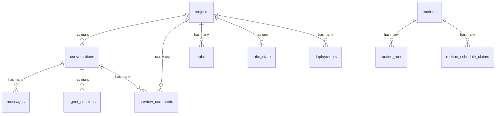

# Open Design 数据库表关系参考

> 基于 `apps/daemon/src/db.ts` · 共 11 张表 · SQLite (WAL 模式)

## 表清单

### 核心业务

| 表 | 主键 | 外键 | 用途 |
|---|---|---|---|
| projects | id | — | 项目注册表 |
| conversations | id | project_id → projects | 聊天会话 |
| messages | id | conversation_id → conversations | 聊天消息 |
| agent_sessions | (conversation_id, agent_id) | conversation_id → conversations | 代理会话追踪 |

### 制品与 UI

| 表 | 主键 | 外键 | 用途 |
|---|---|---|---|
| preview_comments | id | project_id → projects, conversation_id → conversations | 制品评审评论 |
| tabs | (project_id, name) | project_id → projects | 工作区标签页 |
| tabs_state | project_id | project_id → projects | 标签页状态 |

### 自动化

| 表 | 主键 | 外键 | 用途 |
|---|---|---|---|
| routines | id | — | 自动化例程定义 |
| routine_runs | id | routine_id → routines | 例程执行记录 |
| routine_schedule_claims | (routine_id, slot_at) | routine_id → routines | 调度锁 |

### 部署

| 表 | 主键 | 外键 | 用途 |
|---|---|---|---|
| deployments | id | project_id → projects | 项目部署记录 |

### 独立

| 表 | 主键 | 用途 |
|---|---|---|
| templates | id | 可复用模板（无外键） |

## Mermaid ER 图



## 核心链路

```
projects → conversations → messages
                       → agent_sessions
         → preview_comments
         → tabs / tabs_state
         → deployments

routines → routine_runs
         → routine_schedule_claims
```

## 级联删除

所有子表使用 `ON DELETE CASCADE`：删除 project 自动清理所有关联数据。
