# Open Design — Architecture

> Auto-generated on 2026-06-25. Covers v0.11.1.

---

## 1. High-Level Architecture

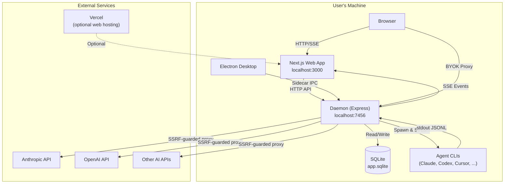

---

## 2. Deployment Topologies

### Topology A: Fully Local (Default)

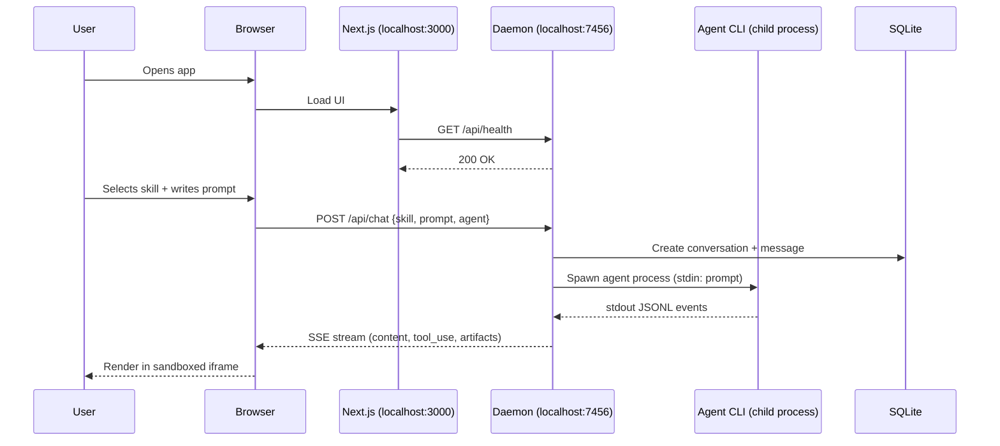

### Topology B: Web on Vercel + Local Daemon

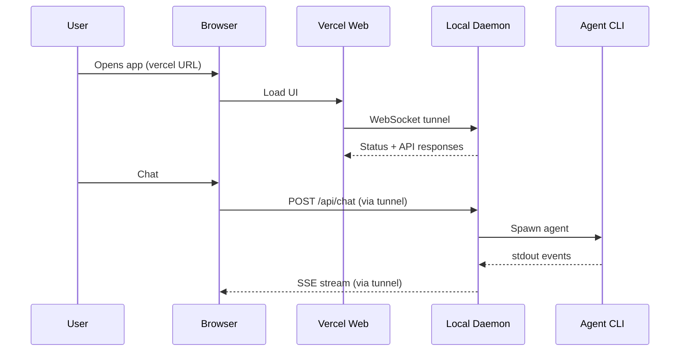

### Topology C: Web on Vercel + Direct API (No Daemon)

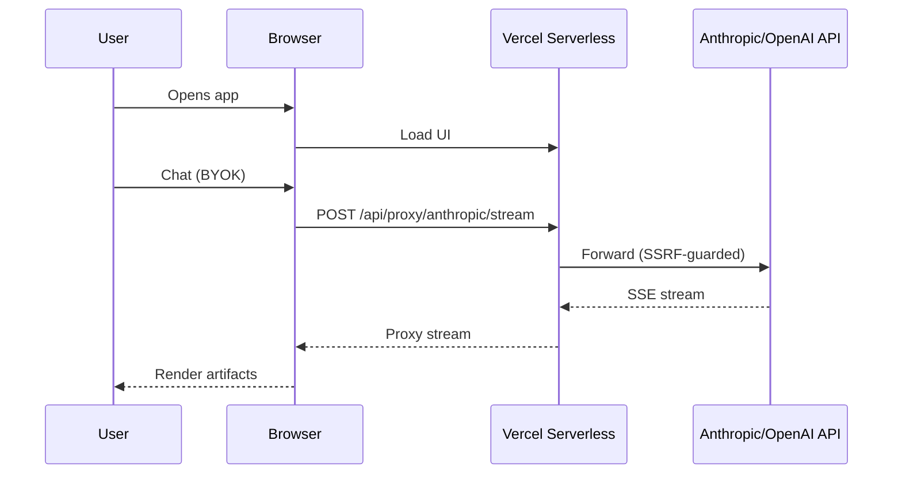

---

## 3. Data Flow — Chat to Artifact

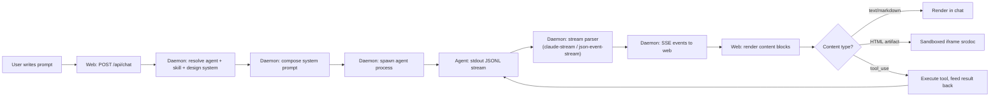

---

## 4. Module Dependency Graph

```mermaid
graph TD
    subgraph "Apps"
        Web["@open-design/web"]
        Daemon["@open-design/daemon"]
        Desktop["@open-design/desktop"]
        Packaged["@open-design/packaged"]
    end

    subgraph "Core Packages"
        Contracts["@open-design/contracts"]
        Components["@open-design/components"]
        Sidecar["@open-design/sidecar"]
        SidecarProto["@open-design/sidecar-proto"]
        Platform["@open-design/platform"]
    end

    subgraph "Protocol Packages"
        Host["@open-design/host"]
        LauncherProto["@open-design/launcher-proto"]
        AguiAdapter["@open-design/agui-adapter"]
    end

    subgraph "Utility Packages"
        PluginRuntime["@open-design/plugin-runtime"]
        RegistryProtocol["@open-design/registry-protocol"]
        Diagnostics["@open-design/diagnostics"]
        Download["@open-design/download"]
        Release["@open-design/release"]
        Metatool["@open-design/metatool"]
    end

    Web --> Contracts
    Web --> Components
    Daemon --> Contracts
    Daemon --> Platform
    Daemon --> PluginRuntime
    Desktop --> Sidecar
    Desktop --> SidecarProto
    Packaged --> Sidecar
    Packaged --> SidecarProto
    Sidecar --> SidecarProto
    Sidecar --> Platform
    Host --> Contracts
    AguiAdapter --> Contracts
    Diagnostics --> Platform
```

---

## 5. Daemon Internal Architecture

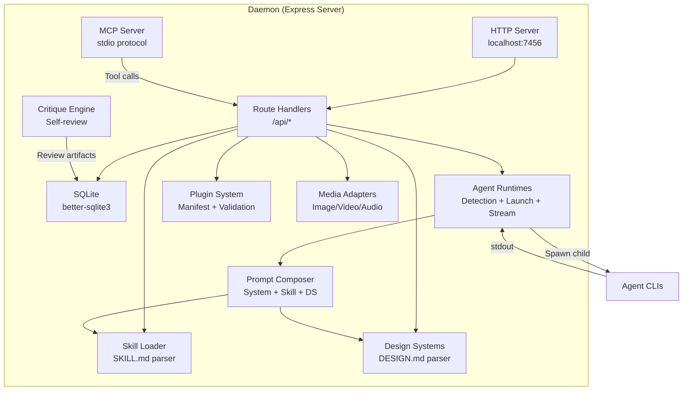

---

## 6. Sidecar IPC Architecture

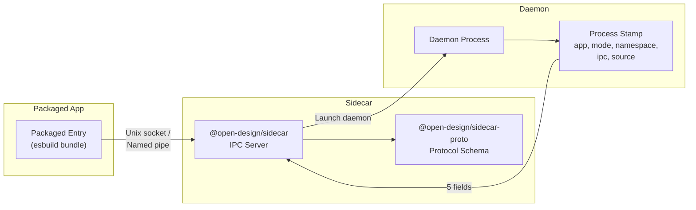

---

## 7. Plugin Ecosystem Architecture

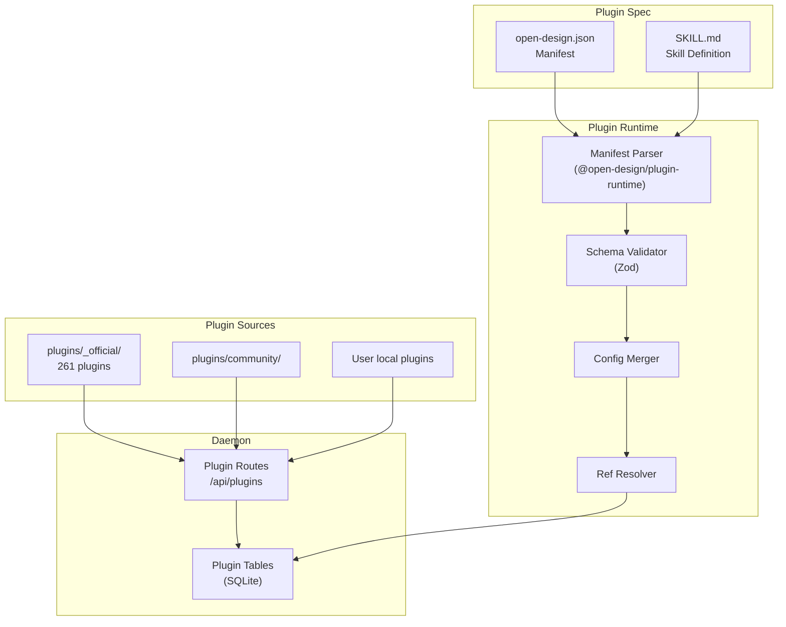

---

## 8. Skill & Design System Flow

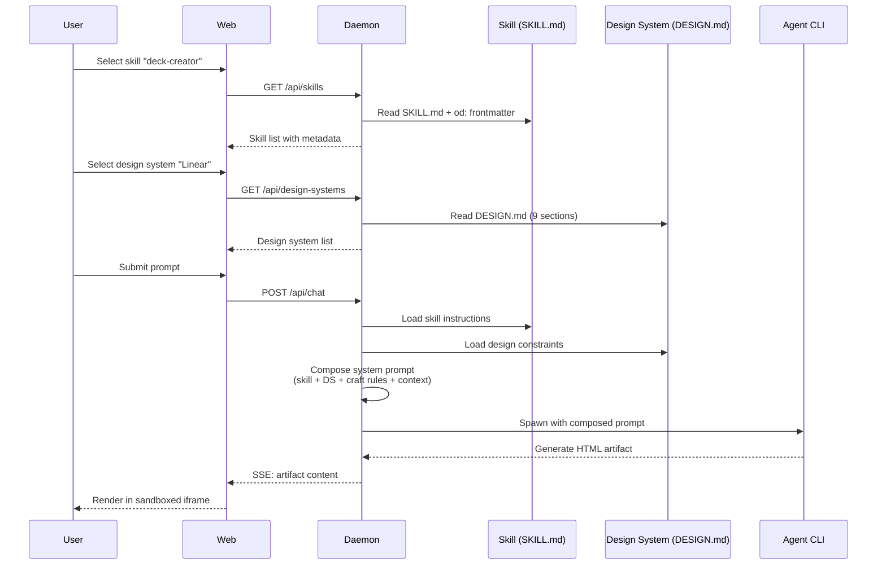

---

## 9. Agent Stream Processing

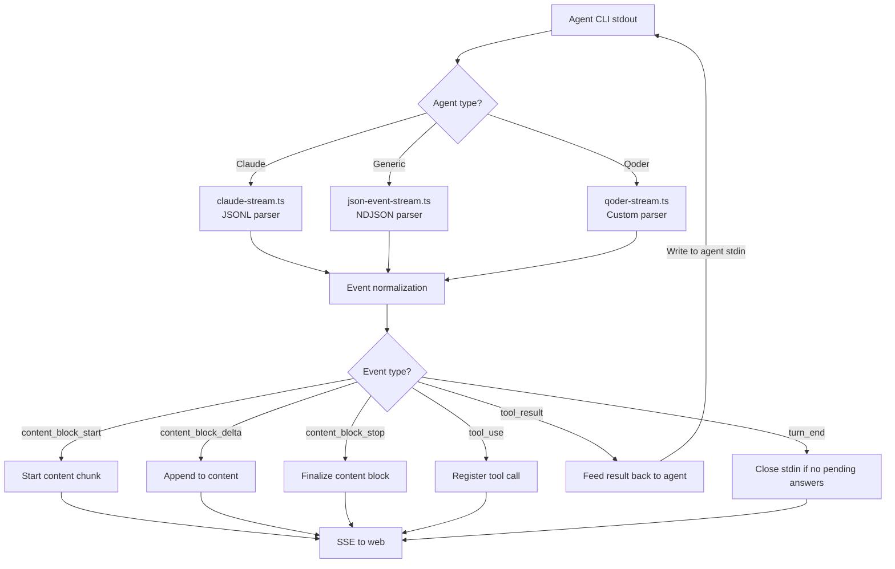

---

## 10. Key Architectural Decisions

### 10.1 Agent-Native, Model-Agnostic

Open Design does **not** ship its own AI model or agent. It discovers coding-agent CLIs on the user's PATH and orchestrates them. This means:
- Users bring their own API keys and model access
- The system works with any agent that speaks JSONL/NDJSON stdout
- Agent capabilities are discovered at runtime via `capabilities.ts`

### 10.2 Skill-Driven Design

Every design task is driven by a **SKILL.md** file — a Markdown document with YAML frontmatter that defines:
- The skill's mode (prototype, deck, image, etc.)
- Required craft rules
- Prompt templates
- Output format expectations

Agents read SKILL.md as part of their system prompt and follow its instructions.

### 10.3 Design System Contracts

Brand consistency is enforced through **DESIGN.md** files with a 9-section schema:
1. Color palette
2. Typography scale
3. Spacing system
4. Layout grid
5. Component library
6. Motion/animation
7. Voice/tone
8. Brand guidelines
9. Anti-patterns

### 10.4 Sandboxed Artifact Preview

All generated artifacts (HTML, SVG, etc.) are rendered in a sandboxed iframe:
```html
<iframe sandbox="allow-scripts" srcdoc="..."></iframe>
```
This prevents untrusted generated code from accessing the host page, localStorage, or making arbitrary network requests.

### 10.5 SQLite as Single Source of Truth

The daemon uses a single SQLite file (`app.sqlite`) in WAL mode for all persistent state: projects, conversations, messages, plugins, media tasks. This keeps the system fully local with no external database dependency.

### 10.6 Capability Dual-Track

Every user-facing feature must be accessible through **both** the web UI **and** the `od` CLI. Both surfaces call the same `/api/*` endpoints. The CLI supports `--json` for machine-readable output and `--prompt-file` for piped input.

### 10.7 MCP Server Integration

The daemon exposes an MCP (Model Context Protocol) server over stdio, installable into any MCP-compatible agent. This allows external agents to call Open Design's tools (artifact rendering, design system lookup, etc.) as MCP tool calls.

---

## 11. Release Channel Model

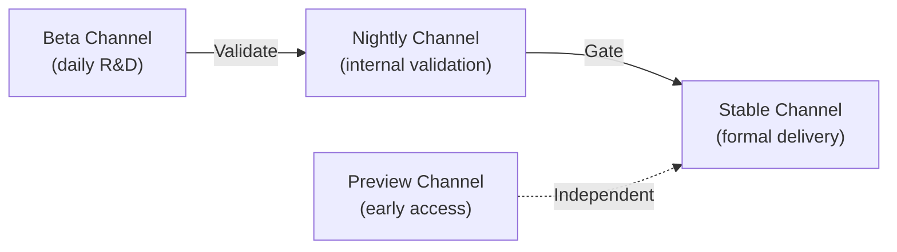

| Channel | App Identity | Purpose |
|---|---|---|
| `beta` | Open Design Beta | Daily R&D/development validation |
| `nightly` | Open Design | Internal validation for stable delivery |
| `preview` | Open Design Preview | Early-access with stable-like rigor |
| `stable` | Open Design | Formal delivery |

---

## 12. i18n Architecture

- **24 locales** supported: ar, de, en, es-ES, fa, fr, hu, id, ja, ko, pl, pt-BR, ru, th, tr, uk, zh-CN, zh-TW, and more
- Typed `Dict` in `apps/web/src/i18n/types.ts`
- Each locale is a separate `.ts` file under `apps/web/src/i18n/locales/`
- Missing keys produce typecheck errors
