# Open Design — 架构文档

> 自动生成于 2026-06-25，覆盖 v0.11.1 版本。

---

## 1. 高层架构

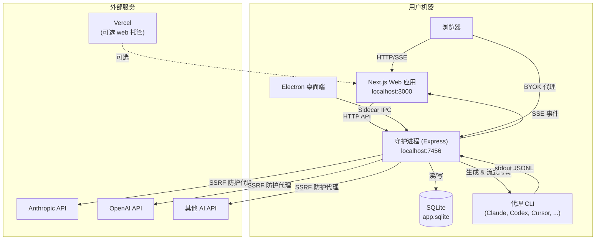

---

## 2. 部署拓扑

### 拓扑 A：完全本地（默认）

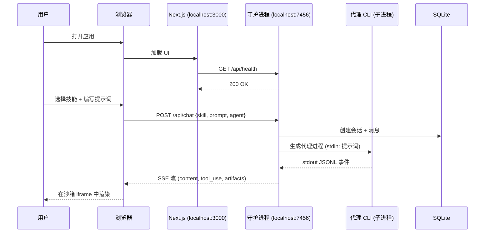

### 拓扑 B：Vercel Web + 本地守护进程

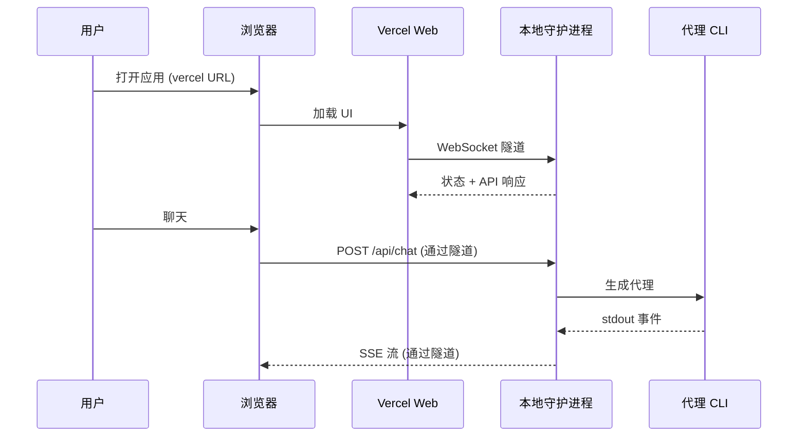

### 拓扑 C：Vercel Web + 直连 API（无守护进程）

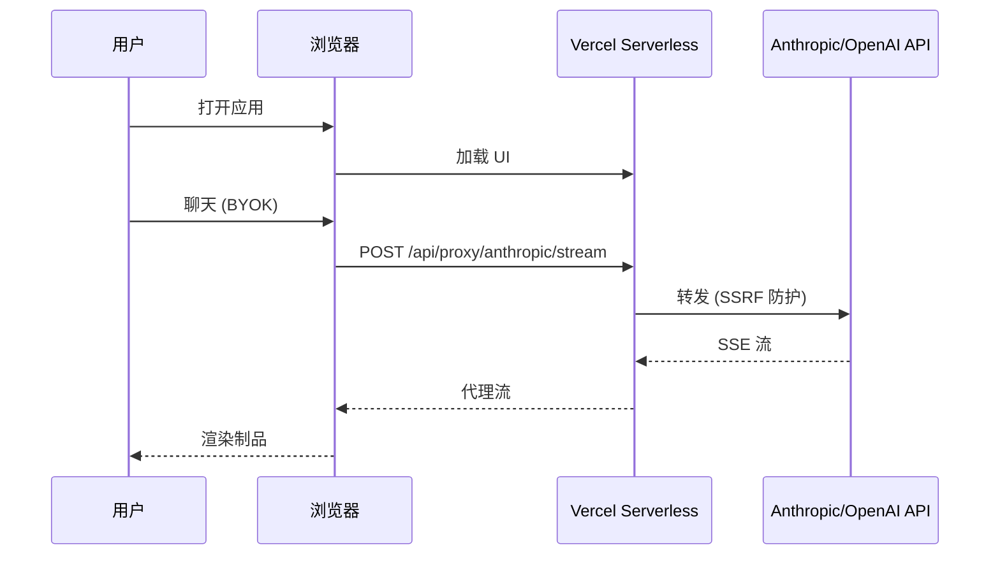

---

## 3. 数据流 — 从聊天到制品

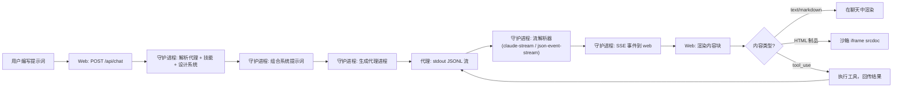

---

## 4. 模块依赖图

```mermaid
graph TD
    subgraph "应用"
        Web["@open-design/web"]
        Daemon["@open-design/daemon"]
        Desktop["@open-design/desktop"]
        Packaged["@open-design/packaged"]
    end

    subgraph "核心包"
        Contracts["@open-design/contracts"]
        Components["@open-design/components"]
        Sidecar["@open-design/sidecar"]
        SidecarProto["@open-design/sidecar-proto"]
        Platform["@open-design/platform"]
    end

    subgraph "协议包"
        Host["@open-design/host"]
        LauncherProto["@open-design/launcher-proto"]
        AguiAdapter["@open-design/agui-adapter"]
    end

    subgraph "工具包"
        PluginRuntime["@open-design/plugin-runtime"]
        RegistryProtocol["@open-design/registry-protocol"]
        Diagnostics["@open-design/diagnostics"]
        Download["@open-design/download"]
        Release["@open-design/release"]
        Metatool["@open-design/metatool"]
    end

    Web --> Contracts
    Web --> Components
    Daemon --> Contracts
    Daemon --> Platform
    Daemon --> PluginRuntime
    Desktop --> Sidecar
    Desktop --> SidecarProto
    Packaged --> Sidecar
    Packaged --> SidecarProto
    Sidecar --> SidecarProto
    Sidecar --> Platform
    Host --> Contracts
    AguiAdapter --> Contracts
    Diagnostics --> Platform
```

---

## 5. 守护进程内部架构

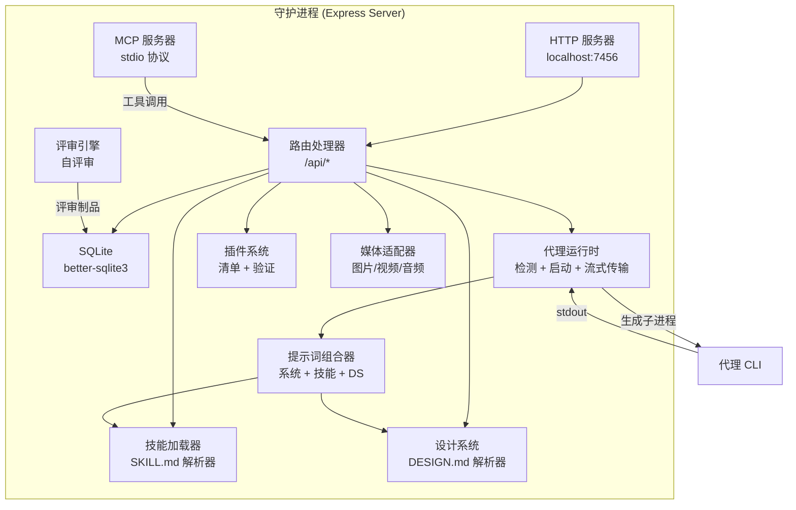

---

## 6. Sidecar IPC 架构

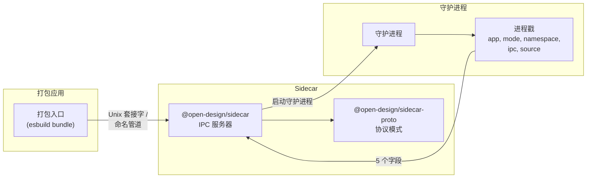

---

## 7. 插件生态系统架构

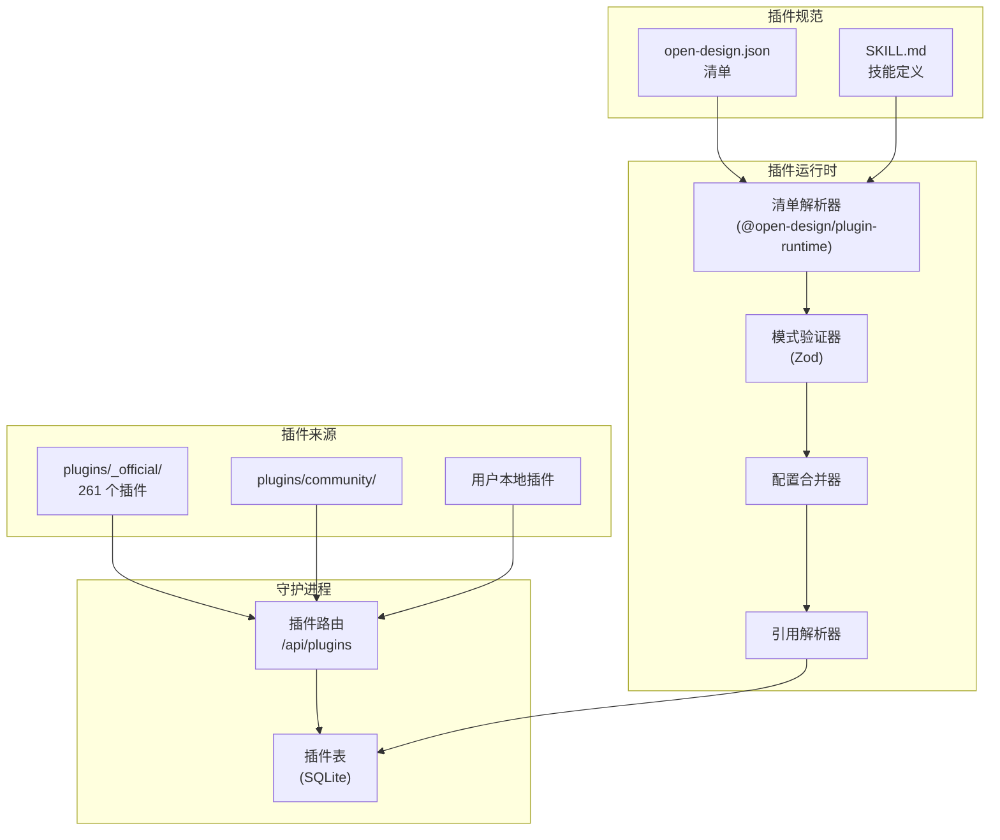

---

## 8. 技能与设计系统流程

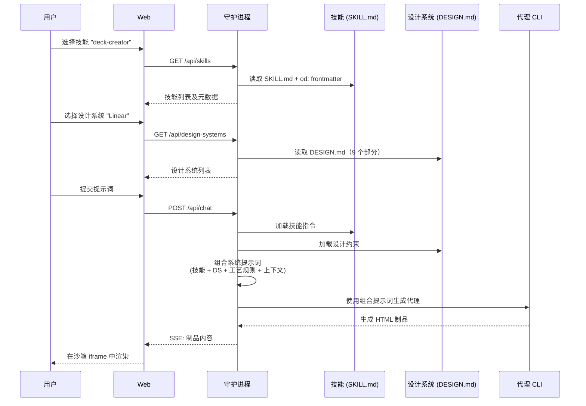

---

## 9. 代理流处理

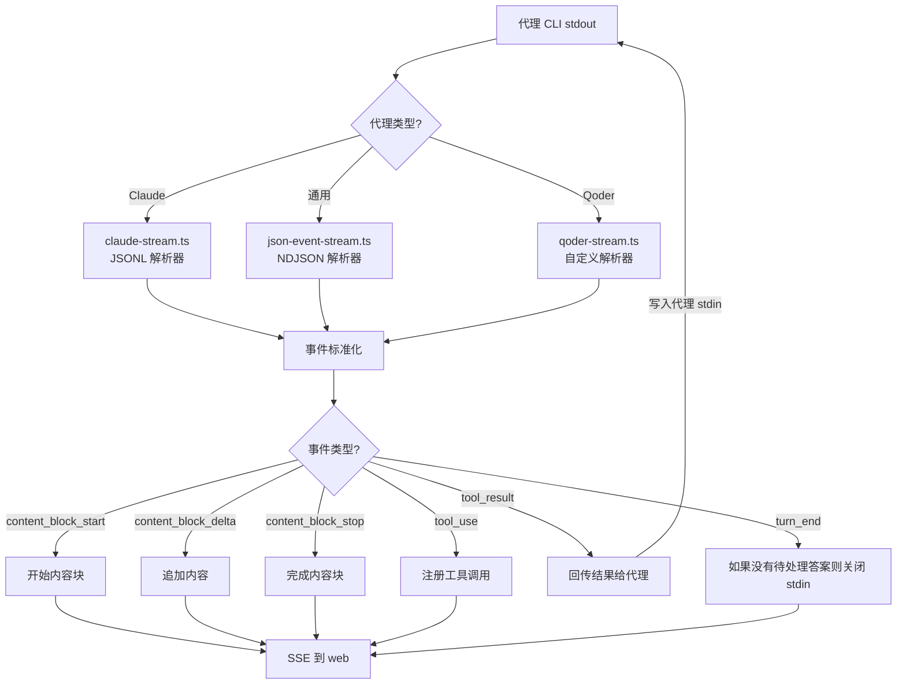

---

## 10. 关键架构决策

### 10.1 代理原生、模型无关

Open Design **不**附带自己的 AI 模型或代理。它发现用户 PATH 中的编码代理 CLI 并编排它们。这意味着：
- 用户自带 API 密钥和模型访问权限
- 系统适用于任何输出 JSONL/NDJSON stdout 的代理
- 代理功能在运行时通过 `capabilities.ts` 发现

### 10.2 技能驱动设计

每个设计任务由一个 **SKILL.md** 文件驱动 — 一个带有 YAML frontmatter 的 Markdown 文档，定义：
- 技能的模式（prototype、deck、image 等）
- 所需的工艺规则
- 提示词模板
- 输出格式期望

代理在系统提示词中读取 SKILL.md 并遵循其指令。

### 10.3 设计系统契约

品牌一致性通过 **DESIGN.md** 文件强制执行，包含 9 个部分的模式：
1. 调色板
2. 排版比例
3. 间距系统
4. 布局网格
5. 组件库
6. 动效/动画
7. 语调
8. 品牌指南
9. 反模式

### 10.4 沙箱制品预览

所有生成的制品（HTML、SVG 等）在沙箱 iframe 中渲染：
```html
<iframe sandbox="allow-scripts" srcdoc="..."></iframe>
```
这防止不受信任的生成代码访问宿主页面、localStorage 或发起任意网络请求。

### 10.5 SQLite 作为唯一数据源

守护进程使用单个 SQLite 文件（`app.sqlite`），采用 WAL 模式存储所有持久状态：项目、会话、消息、插件、媒体任务。这使系统完全本地化，无需外部数据库依赖。

### 10.6 能力双轨制

每个面向用户的功能必须通过 **Web UI** 和 **`od` CLI** 两种方式可访问。两种表面调用相同的 `/api/*` 端点。CLI 支持 `--json` 用于机器可读输出，支持 `--prompt-file` 用于管道输入。

### 10.7 MCP 服务器集成

守护进程通过 stdio 暴露 MCP（模型上下文协议）服务器，可安装到任何兼容 MCP 的代理中。这允许外部代理通过 MCP 工具调用调用 Open Design 的工具（制品渲染、设计系统查询等）。

---

## 11. 发布频道模型

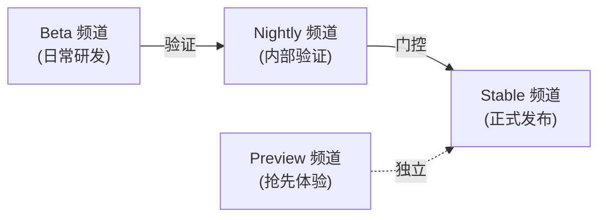

| 频道 | 应用标识 | 用途 |
|---|---|---|
| `beta` | Open Design Beta | 日常研发/开发验证 |
| `nightly` | Open Design | 稳定发布的内部验证 |
| `preview` | Open Design Preview | 具有稳定版严谨度的抢先体验 |
| `stable` | Open Design | 正式发布 |

---

## 12. 国际化架构

- 支持 **24 种语言**：ar、de、en、es-ES、fa、fr、hu、id、ja、ko、pl、pt-BR、ru、th、tr、uk、zh-CN、zh-TW 等
- `apps/web/src/i18n/types.ts` 中的类型化 `Dict`
- 每种语言是 `apps/web/src/i18n/locales/` 下的独立 `.ts` 文件
- 缺失的键会产生类型检查错误
